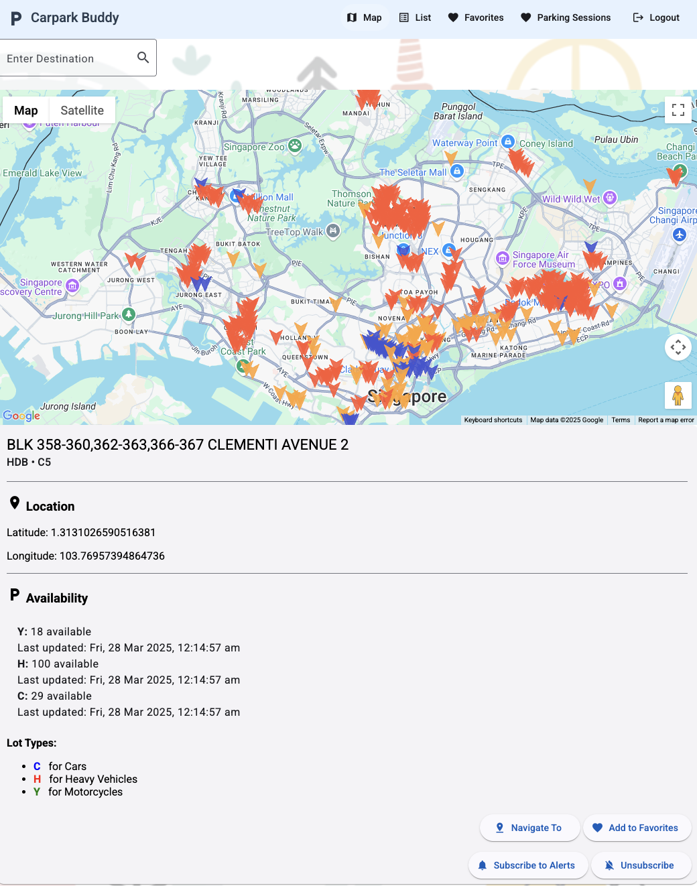

# 🚗 Parking Buddy — Singapore Smart Carpark Finder App

**Parking Buddy** is a full-stack web application designed to help drivers in Singapore easily locate available carparks using real-time data from URA, HDB, and LTA.  
With interactive maps, navigation, smart alerts, and personalized features, Parking Buddy brings convenience to your daily drive.

🌐 **Live Site**: [https://www.parkingbuddy.site](https://www.parkingbuddy.site)  
⚠️ *Backend currently offline due to hosting costs.*

---

## 🔑 Features

### 🅿️ Carpark Discovery
- Live data integration from **URA**, **HDB**, and **LTA** APIs
- Availability shown for cars, motorcycles, and heavy vehicles
- Filter carparks by agency (URA / HDB / LTA)
- Color-coded map markers by agency type
- Search by carpark name or location (Google Maps)

### 🗺️ Interactive Map
- Google Maps API with draggable/zoomable interface
- Markers auto-update with real-time availability
- Route planning with “Navigate to Carpark” button

### ❤️ User Personalization
- Account creation with **JWT-secured login**
- **Welcome email** upon registration
- Add favorite carparks for quick access
- Log your parking location (e.g., block, level, lot number)

### 🔔 Smart Telegram Alerts
- Subscribe to carparks for **low-lot availability alerts**
- Get real-time notifications via Telegram
- One-click subscribe/unsubscribe

### 📋 Bonus Goodies
- Built with Angular SPA (4+ views)
- Custom navbar with user display
- Search + filter features for listings
- Mobile-friendly & installable (PWA with manifest)
- Full **CRUD** operations
- SQL + NoSQL dual-database support

---

## 🛠️ Tech Stack

### 🖥 Frontend
- Angular 17
- Angular Material (UI Components)
- Reactive Forms + Component Store
- Google Maps API
- App Manifest (PWA support)
- Deployed via **Vercel**

### ⚙️ Backend
- Spring Boot (REST API)
- Spring Security + **JWT Authentication**
- Welcome Email Service
- Telegram Bot API integration
- URA / HDB / LTA API integration
- Deployed via **Railway**

### 💾 Databases
- **MySQL**: Core data (users, carparks, favorites)
- **MongoDB Atlas**: Live lot availability data

---

## ✅ Mandatory Requirements Implemented

- ✅ Reactive Angular Forms
- ✅ GET, POST, PUT, DELETE API endpoints
- ✅ SPA with 4+ views using Angular Router
- ✅ Angular Component Store for state management
- ✅ Google Maps + LTA/URA API integrations
- ✅ JWT-secured login & multi-user support
- ✅ MySQL (main DB) with relational modeling
- ✅ MongoDB (as second DB)
- ✅ Dockerized + cloud deployment (Vercel + Railway + MongoDB Atlas)
- ✅ Application Manifest for PWA

---

## ⭐ Features Implemented

| Feature                           | Description                                      |
|-----------------------------------|--------------------------------------------------|
| ✅ JWT Authentication             | Secure login + protected backend APIs            |
| ✅ Telegram Bot Alerts            | Subscribe/unsubscribe for lot availability       |
| ✅ Email Notification             | Sends welcome email upon registration            |
| ✅ Google Maps Integration        | Interactive map with live markers                |
| ✅ Angular Material               | Clean, responsive UI                             |
| ✅ App Manifest (PWA-ready)       | Enables mobile install experience                |

---

## 🖼️ Screenshots

### 🗺️ Map with Live Carpark Markers

---
